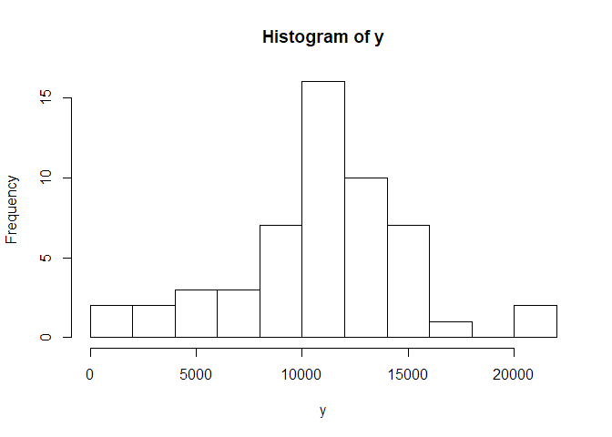
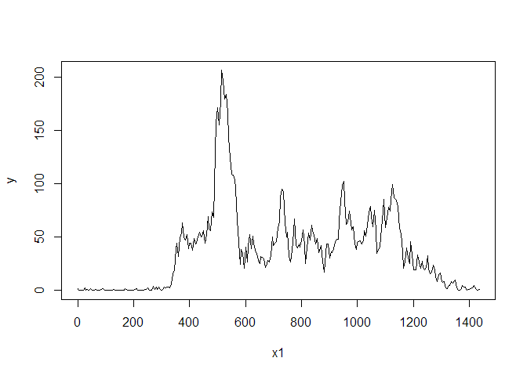
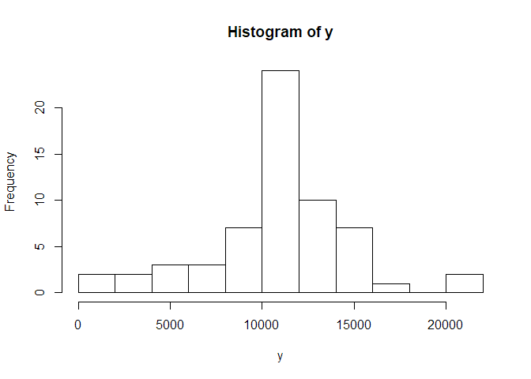
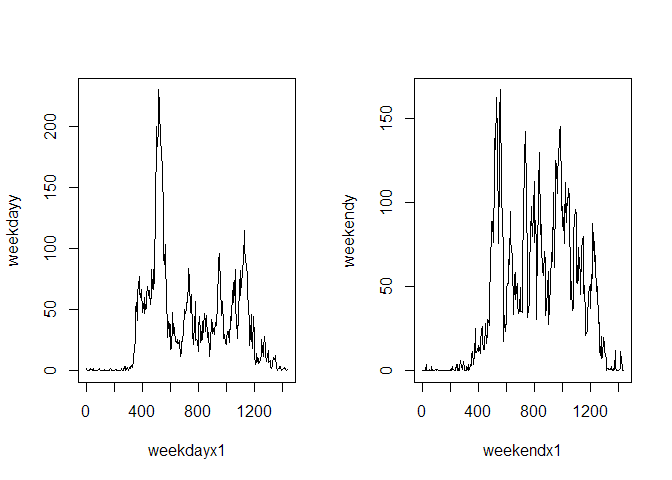

## Loading and preprocessing the data
We first load in the data.

```r
activity <- read.csv('activity.csv')
```


## What is mean total number of steps taken per day?
In order to answer this question, we would first have to remove any missing values from the dataset. After which, this question can be answered by taking the mean of the step count after subsetting for each day.


```r
hist1 <- activity[!is.na(activity[,1]),]
y <- tapply(hist1$steps,hist1$date,sum)
y <- y[!is.na(y)]
y
```

```
## 2012-10-02 2012-10-03 2012-10-04 2012-10-05 2012-10-06 2012-10-07 
##        126      11352      12116      13294      15420      11015 
## 2012-10-09 2012-10-10 2012-10-11 2012-10-12 2012-10-13 2012-10-14 
##      12811       9900      10304      17382      12426      15098 
## 2012-10-15 2012-10-16 2012-10-17 2012-10-18 2012-10-19 2012-10-20 
##      10139      15084      13452      10056      11829      10395 
## 2012-10-21 2012-10-22 2012-10-23 2012-10-24 2012-10-25 2012-10-26 
##       8821      13460       8918       8355       2492       6778 
## 2012-10-27 2012-10-28 2012-10-29 2012-10-30 2012-10-31 2012-11-02 
##      10119      11458       5018       9819      15414      10600 
## 2012-11-03 2012-11-05 2012-11-06 2012-11-07 2012-11-08 2012-11-11 
##      10571      10439       8334      12883       3219      12608 
## 2012-11-12 2012-11-13 2012-11-15 2012-11-16 2012-11-17 2012-11-18 
##      10765       7336         41       5441      14339      15110 
## 2012-11-19 2012-11-20 2012-11-21 2012-11-22 2012-11-23 2012-11-24 
##       8841       4472      12787      20427      21194      14478 
## 2012-11-25 2012-11-26 2012-11-27 2012-11-28 2012-11-29 
##      11834      11162      13646      10183       7047
```

A histogram of the total number of steps taken each day is as follows.


```r
hist(y,10)
```

<!-- -->

For the mean and median total number of steps taken each day, we have:


```r
mean(y)
```

```
## [1] 10766.19
```

```r
median(y)
```

```
## [1] 10765
```


## What is the average daily activity pattern?

Each day is divided into 5 minute intervals. We first take the unique values of each 5-minute interval (`x`) and calculate the mean number of step taken for each time interval (`y`), and then make the plot.

One salient point to note is that because of the format of the time intervals (`hhmm`), in order to make a accurate time series we first have to transform the times. For example, a time of 0100 needs to be converted into 60; we essentially take the "hundreds" part of the number and convert them into multiples of 60.


```r
intervals <- unique(hist1$interval)
x <- unique(intervals)
y <- numeric(length(x))
x1 <- numeric(length(x))

for(i in 1:length(x)) {
  y[i] <- mean(hist1$steps[hist1$interval == x[i]])
  k <- floor(x[i]/100)
  x1[i] <- x[i] - 40 * k
}

plot(x=x1,y=y,type="l")
```

<!-- -->

In order to determine the time interval with the highest mean steps, we make a data frame and order by the mean steps taken:


```r
table <-  data.frame(x=x,y=y)[order(y,decreasing=TRUE),]
head(table)
```

```
##       x        y
## 104 835 206.1698
## 105 840 195.9245
## 107 850 183.3962
## 106 845 179.5660
## 103 830 177.3019
## 101 820 171.1509
```

From this we see that the maximum mean steps taken (206) occurs at 8.35am.

## Imputing missing values

The number of entries with missing values is given by


```r
sum(is.na(activity[,1]))
```

```
## [1] 2304
```

We choose to impute the mean number of steps taken in the interval for each missing value, to produce a new dataset `imputed` with the missing values filled in.


```r
imputed <- activity
for(i in 1:nrow(activity)) {
  if(is.na(activity[i,1])) {
    imputed[i,1] <- table$y[match(activity[i,3],table$x)]
  }
}
```


We do the same as before for the histogram, mean and median:


```r
y <- tapply(imputed$steps,imputed$date,sum)
hist(y,10)
```

<!-- -->

```r
mean(y)
```

```
## [1] 10766.19
```

```r
median(y)
```

```
## [1] 10766.19
```

The calculated mean and median are almost the same from the first part of the report, but this time the  median total number of steps each day is fractional, instead of a whole number of steps, because the imputed values were frational.

Since we imputed the missing values with numbers we got by calculating means, the histogram has slightly lower outer-bars as a pseudo-"central limit theorem effect"; everything is pushed togther toward the middle.

## Are there differences in activity patterns between weekdays and weekends?

We first split the datasets into weekday and weekend datasets.


```r
days <- weekdays(as.Date(activity$date))
weekends <- imputed[!is.na(match(days,c("Saturday","Sunday"))),] 
weekdays <- imputed[!is.na(match(days,c("Monday","Tuesday","Wednesday","Thursday","Friday"))),] 
```

Then we make the time-series plots using similar code to before.


```r
weekday.intervals <- unique(weekdays$interval)
weekdayx <- unique(weekday.intervals)
weekdayy <- numeric(length(weekdayx))
weekdayx1 <- numeric(length(weekdayx))

for(i in 1:length(weekdayx)) {
  weekdayy[i] <- mean(weekdays$steps[weekdays$interval == weekdayx[i]])
  k <- floor(weekdayx[i]/100)
  weekdayx1[i] <- weekdayx[i] - 40 * k
}

weekend.intervals <- unique(weekends$interval)
weekendx <- unique(weekend.intervals)
weekendy <- numeric(length(weekendx))
weekendx1 <- numeric(length(weekendx))

for(i in 1:length(weekendx)) {
  weekendy[i] <- mean(weekends$steps[weekends$interval == weekendx[i]])
  k <- floor(weekendx[i]/100)
  weekendx1[i] <- weekendx[i] - 40 * k
}
par(mfrow=c(1,2))
plot(x=weekdayx1,y=weekdayy,type="l")
plot(x=weekendx1,y=weekendy,type="l")
```

<!-- -->
